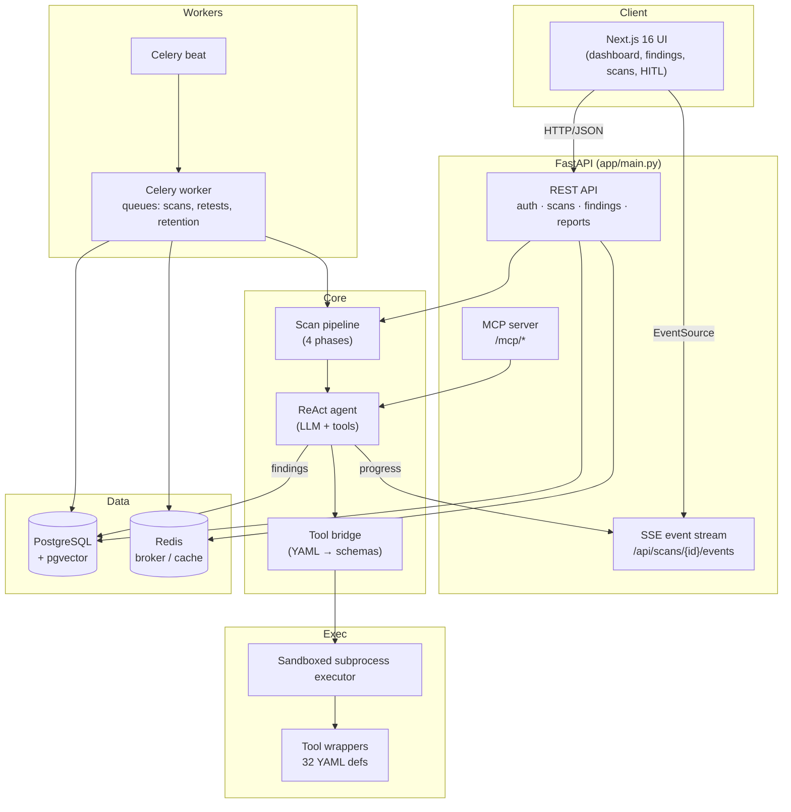

# VAPT-AI

> **AI-driven Vulnerability Assessment & Penetration Testing platform.**
> An autonomous ReAct agent that plans, executes real security tooling, proves
> impact, and produces auditable findings, evidence chains and reports.

`v3.2.1` · FastAPI · Next.js 16 · PostgreSQL + pgvector · Celery + Redis

---

## Table of Contents

- [What it is](#what-it-is)
- [Architecture at a glance](#architecture-at-a-glance)
- [The scan pipeline](#the-scan-pipeline)
- [The ReAct agent](#the-react-agent)
- [Tools](#tools)
- [Evidence, findings & reports](#evidence-findings--reports)
- [Orchestration modes](#orchestration-modes)
- [Knowledge graph & RL](#knowledge-graph--rl)
- [API surface](#api-surface)
- [Data model](#data-model)
- [Configuration](#configuration)
- [Getting started](#getting-started)
- [Deployment](#deployment)
- [Project layout](#project-layout)
- [Security notes](#security-notes)
- [Testing](#testing)

---

## What it is

VAPT-AI automates the full Vulnerability Assessment and Penetration Testing
workflow. You give it a **target** and a **natural-language goal**; it then:

1. Reasons about the target with an LLM,
2. Selects and runs **real offensive tooling** (`nmap`, `nuclei`, `sqlmap`,
   `ffuf`, `metasploit`, …) through a sandboxed subprocess executor,
3. Records **findings backed by verifiable evidence**,
4. Streams the whole process live to the UI over SSE,
5. Emits **PDF / SARIF reports** with a hash-chained custody trail.

It is designed as an operator-assist platform: one agent, all tools, full
transcript, everything auditable.

---

## Architecture at a glance



---

## The scan pipeline

`app/pentest/scan_pipeline.py` exposes a single entry point:

```python
async def run_scan_pipeline(
    *,
    target: str,
    user_prompt: str = "",
    mode: str = "auto",
    scan_id: str | None = None,
    user_id: uuid.UUID | None = None,
    findings_override: list[PipelineFinding] | None = None,
    session_factory=None,
) -> ScanPipelineResult
```

The pipeline is intentionally small — **four phases**, CyberStrikeAI-style:

| # | Phase | What it does |
|---|-------|--------------|
| 1 | **Init** | Registers the scan, emits the start event, creates the `Scan` DB row |
| 2 | **ReAct loop** | Single agent + all tools; LLM calls tools, records findings, calls `exit` |
| 3 | **Persist** | Writes findings, evidence and process detail to PostgreSQL |
| 4 | **Report** | Builds the report bundle (PDF / SARIF) and custody chain |

Cancellation is cooperative: `scan_registry.is_aborted(scan_id)` is checked
before the loop, during it, and after it, so the UI **Abort** button stops work
at the next safe boundary.

`findings_override` is the test seam — inject canned findings and skip the LLM
entirely.

---

## The ReAct agent

`app/agents/react_agent.py` is the heart of the system.

```python
async def run_react_scan(
    target: str,
    user_prompt: str,
    llm_config: dict[str, Any],
    scan_id: str,
    max_iterations: int = 100,
    executor: Any = None,
) -> dict[str, Any]
```

Loop shape:

1. **Preflight** — validate the LLM config (`api_key`, `model`, `base_url`)
   before spending a single token; fail fast with a clear error.
2. **Build tool schemas once** — `build_tool_schemas()` is called a single time
   and reused each iteration (avoids per-turn rebuild cost).
3. **Create executor** — a sandboxed `SubprocessExecutor` scoped to this target
   and scan ID.
4. **Iterate** — the LLM emits `thought` → `tool_call`; the bridge executes it
   and feeds the result back. Progress is streamed via SSE at every step.
5. **Terminate** — the agent calls `exit` when the assessment is complete.

Guards baked into the loop:

- **Per-tool failure tracking** — `tool_fail_counts` circuit-breaks a tool that
  keeps failing, instead of looping forever.
- **Context pruning** — `_prune_old_tool_results()` trims stale, bulky tool
  output so long scans stay inside the context window.
- **Stall/error detection** — `_is_stall_or_error()` spots dead-end outputs.
- **Token budget warnings** — the loop warns before exhausting the budget.
- **System prompt rules** — evidence and commands must be *real*; placeholders
  such as `{{URL}}`, `<target>` or `$URL` are rejected, and the tool name must
  be genuine.

---

## Tools

Tools are **declarative YAML**, not code. `app/tools/loader.py` reads every
`*.yaml` and `app/agents/tool_bridge.py` turns each one into an LLM tool schema
plus an async executor.

Each definition carries the binary, its argument template, parse hints for
extracting findings, and an optional wordlist reference.

**32 tool wrappers ship today:**

| Category | Tools |
|----------|-------|
| Recon / enumeration | `nmap`, `masscan`, `rustscan`, `fscan`, `httpx`, `whatweb`, `dnsenum`, `fierce`, `amass`, `subfinder`, `theharvester`, `gau`, `waybackurls` |
| Web fuzzing / scanning | `ffuf`, `feroxbuster`, `gobuster`, `katana`, `nuclei`, `nikto`, `dalfox`, `wpscan`, `sqlmap` |
| Credentials / exploitation | `hydra`, `john`, `hashcat`, `metasploit`, `impacket`, `netexec`, `responder` |
| Post-exploitation | `linpeas`, `winpeas`, `mimikatz` |

Wordlists live under `data/wordlists/`; `loader._resolve_wordlist()` resolves
logical names to real paths.

---

## Evidence, findings & reports

- **Evidence** is written exclusively through the `record_vulnerability` tool
  (`app/agents/tool_bridge.py`) and is always tagged `layer="detection"`.
- **Custody** — `app/evidence/custody.py` maintains a hash chain so any
  tampering is detectable; `/api/findings/{id}/custody-chain` and
  `/api/scans/{id}/custody-verify` expose verification.
- **CVSS** scoring is handled in `app/evidence/cvss.py`.
- **Reports** — `app/report/collector.py` gathers scan + findings + evidence +
  audit into `FindingReportData`, then:
  - `pdf_exporter.py` (ReportLab) renders the human report, with a
    *Proof of Concept* section that falls back from exploitation to detection,
  - `sarif_exporter.py` emits machine-readable SARIF for CI pipelines.

> Severity is stored as a **string**, so it is never used in `ORDER BY`;
> ranking is done in Python via `_SEVERITY_RANK`.

---

## Orchestration modes

`app/orchestration/mode_selector.py` chooses a strategy from the target and
goal, and `app/orchestration/base.py` defines the shared `BaseOrchestrator` and
`OrchestrationResult` abstractions. Available modes include `single_url`,
`deep` and `plan_execute`. Simple targets short-circuit to a single ReAct loop;
the `mode` argument is kept for API backward compatibility.

---

## Knowledge graph & RL

- **Knowledge graph** (`app/kg/`) — `graph.py`, `persistence.py`, `seeder.py`,
  `types.py`. Backed by PostgreSQL + pgvector.
- **Reinforcement learning** (`app/rl/`) — `state_encoder.py`, `policy.py`,
  `q_learner.py`, `reward.py`, `experience_store.py`, `training_loop.py`. The
  agent's tool-selection choices are recorded as experience and improved over
  time. Artifacts live under `data/rl/`.

---

## API surface

The FastAPI app is built by `create_app()` in `app/main.py`. Highlights:

| Group | Endpoints |
|-------|-----------|
| **System** | `GET /health`, `GET /api/sanitizer/patterns` |
| **Auth** | `auth_router` (JWT, `HTTPBearer`) |
| **Scans** | `scan_router`, `GET /api/scans/active`, `POST /api/scans/{id}/abort`, `GET /api/scans/{id}/events` (SSE) |
| **Blackboard** | `GET /api/scans/{id}/blackboard`, `GET /api/scans/{id}/facts` |
| **HITL** | `GET /api/hitl/pending/{scan_id}`, `POST /api/hitl/{id}/approve`, `POST /api/hitl/{id}/abort` |
| **Findings** | `GET /api/findings/{id}`, `GET /api/findings/{id}/custody-chain` |
| **Evidence** | `GET /api/evidence/{id}/verify`, `GET /api/scans/{id}/custody-verify` |
| **Consent** | `POST /api/consent/create`, `.../accept-tos`, `.../verify`, `GET /api/consent/scan/{id}` |
| **Audit** | `GET /api/audit/entries`, `GET /api/audit/verify-chain`, `GET /api/audit/stats` |
| **MCP** | `GET /mcp/tools/list`, `GET /mcp/health`, `GET /mcp/tools/definitions`, `GET /api/mcp/executions` |
| **Conversations** | `conversation_router` |
| **Methodology** | `create_methodology_router(...)` |
| **Settings** | `settings_router` |
| **Orchestration** | `orch_router` |
| **History** | `scans_history_router` |
| **Vulnerabilities** | `vulns_router` |
| **Knowledge graph** | `kg_router` |
| **Trace** | `trace_router` |
| **RL** | `rl_router` |
| **Channels** | `channels_router` |

Interactive docs are served at `/docs` and the schema at `/openapi.json`.

---

## Data model

SQLAlchemy 2.0 async models in `app/db/models/`:

`user.py` · `scan.py` · `conversation.py` · `pentest.py` · `evidence`-related ·
`attack_catalog.py` · `attackchain.py` · `methodology.py` · `hitl.py` ·
`process_detail.py` · `replay.py` · `rl.py` · `kg.py` · `audit.py` · `c2.py`

Sessions: `app/db/session.py` (async, asyncpg — canonical runtime) and
`app/db/sync_session.py` (sync, psycopg2 — Alembic + scripts).
Migrations live in `alembic/versions/` (baseline `0001` → `0009`).

---

## Configuration

Two layers:

1. **`.env`** — process/environment settings (admin credentials, JWT secret,
   DB URL, Redis URL, feature flags).
2. **`config.yaml`** — LLM channels, loaded and saved atomically by
   `app/core/channels.py`. This is the **single source of truth** for AI
   channels and is editable from the Settings UI.

Default channel:

```yaml
default_channel: deepseek
ai:
  channels:
    deepseek:
      provider: openai_compatible
      base_url: https://api.deepseek.com/v1
      model: deepseek-flash
      max_total_tokens: 128000
      max_completion_tokens: 4096
      temperature: 0.7
```

Both `config.yaml` and `.env` are **gitignored** — keep them that way.
Start from `.env.example`.

---

## Getting started

### Prerequisites

- Python 3.12+
- Node.js 20+
- PostgreSQL 15+ with the `pgvector` extension
- Redis 7+
- The offensive tools you intend to use, on `PATH` (or install via
  `scripts/install_tools.sh` / `scripts/install_tools_extended.sh`)

### Backend

```bash
python -m venv venv314 && source venv314/bin/activate
pip install -r requirements.txt
cp .env.example .env            # then edit credentials
alembic upgrade head            # create the schema
uvicorn app.main:app --reload --port 8000
```

### Frontend

```bash
cd frontend
npm install
npm run dev                     # http://localhost:3000
```

In development `next.config.ts` rewrites `/api/*`, `/mcp/*`, `/docs`,
`/health` and `/openapi.json` to the backend on `:8000`.

### First scan

1. Open the UI and log in.
2. Go to **Settings → AI Channels** and add a provider + API key.
3. Start a scan with a target and a goal, e.g.
   *"Enumerate this web app and test for injection flaws."*
4. Watch the live transcript; review findings, evidence and the report.

---

## Deployment

Production services are defined under `scripts/systemd/`:

| Unit | Role |
|------|------|
| `vapt-ai-app.service` | uvicorn API (single worker) |
| `vapt-ai-celery-worker.service` | Celery worker — `-Q scans,retests,retention` |
| `vapt-ai-celery-beat.service` | Celery beat scheduler |
| `msfrpcd.service` | Metasploit RPC daemon |

`scripts/setup_systemd.sh` installs and enables them.

> **Single-worker caveat:** the API runs one uvicorn worker. Any blocking call
> inside an async handler stalls *every* request, including `/api/auth/login`.
> Keep blocking work off the event loop (or in Celery).

---

## Project layout

```
app/
├── main.py              # FastAPI app factory + inline routes
├── core/                # config, LLM transport, channels, CVE client, sanitizer
├── agents/              # ReAct agent, tool bridge, LLM shim, call caps/cache
├── pentest/             # scan pipeline, blackboard, SSE events, registry
├── tools/               # 32 YAML tool wrappers + loader
├── skills/              # markdown playbooks (web, recon, AD, priv-esc, …)
├── orchestration/       # mode selector + base orchestrator
├── routes/              # modular routers (scans, findings, kg, rl, trace, …)
├── evidence/            # custody chain, CVSS, evidence service
├── report/              # collector, PDF + SARIF exporters
├── auth/                # JWT manager
├── consent/ audit/      # consent + hash-chained audit log
├── kg/ rl/ mcp/         # knowledge graph, RL, MCP server
├── db/                  # SQLAlchemy models + session factories
└── harness/ sandbox/    # subprocess execution + isolation
workers/                 # Celery app + scan tasks
alembic/                 # migrations
data/                    # wordlists, catalogs, RL artifacts, traces
frontend/                # Next.js 16 + Tailwind + shadcn/ui
scripts/systemd/         # production service units
tests/                   # unit, integration, vapt
```

---

## Security notes

- **Never commit `config.yaml` or `.env`** — they hold live API keys and
  secrets. Both are already gitignored.
- Review `.env.example` before publishing — it is tracked. In particular,
  `MSF_RPC_PASSWORD` should be a placeholder (`change-me`), not a real value.
- Rotate any API key that has ever been written to disk in plaintext.
- Scope guards are controlled by `VAPT_AI_SCOPE_GUARD_DISABLED` and
  `VAPT_AI_HITL_DISABLED`. Both default to `"1"` (**disabled**) — meaning
  forbidden-argument checks and human-in-the-loop gates are effectively off.
  **Enable them for any real engagement.**
- VAPT-AI runs real offensive tooling. Only use it against systems you are
  explicitly authorised to test.

---

## Testing

```bash
pytest                       # config in pytest.ini
pytest tests/unit            # fast unit tests
pytest tests/integration     # end-to-end
python scripts/tools_smoke_test.py   # verify installed tools
```

---

## License

See the repository for licensing terms. Use responsibly and only on
authorised targets.
